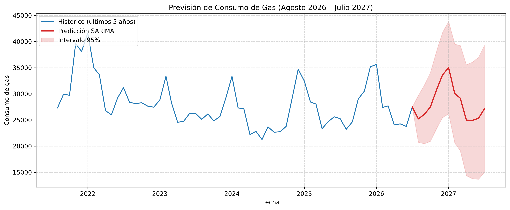

# 📈 Predicción de la Demanda de Gas Natural en España (SARIMA)

Modelización cuantitativa y previsión prospectiva de la demanda mensual de gas natural en España mediante la metodología clásica de **Box-Jenkins**, implementada en Python.

---

## 📑 Índice de Contenidos

* [1. Descripción del Proyecto](#-descripción-del-proyecto)
* [2. Datos Utilizados](#-datos-utilizados)
* [3. Estructura del Repositorio](#-estructura-del-repositorio)
* [3. Flujo Metodológico](#-flujo-metodológico)
  * [3.1. Transformaciones y Estacionariedad](#1-transformaciones-y-estacionariedad)
  * [3.2. Identificación y Estimación (General-to-Specific)](#2-identificación-y-estimación-general-to-specific)
  * [3.3. Diagnosis Residual](#3-diagnosis-residual)
* [4. Predicciones (Agosto 2026 – Julio 2027)](#-predicciones-agosto-2026--julio-2027)
* [5 Limitaciones Metodológicas y Operativas](#-limitaciones-metodológicas-y-operativas)
* [6. Instalación y Uso](#-instalación-y-uso)
* [7. Bibliografía de Referencia](#-bibliografía-de-referencia)

---

## 📌 Descripción del Proyecto

El objetivo de este proyecto es modelar la serie temporal del consumo agregado de gas natural en España (registrado por CORES) para entender su dinámica estacional y generar predicciones prospectivas robustas a 12 meses vista (agosto 2026 – julio 2027) con intervalos de confianza al 95%.

El flujo de trabajo sigue rigurosamente el proceso econométrico formal:
1. **Análisis exploratorio y estabilización** (media y varianza).
2. **Estrategia General-to-Specific** para la selección del modelo.
3. **Validación cruzada fuera de muestra** (conjunto de test).
4. **Diagnosis exhaustiva de residuos** (ruido blanco débil).
5. **Reestimación muestral completa y proyección prospectiva**.

---

## 📊 Datos Utilizados

* **Fuente:** Registros oficiales de la Corporación de Reservas Estratégicas de Productos Petrolíferos (CORES).
* **Frecuencia:** Mensual (`freq='MS'`).
* **Rango temporal completo:** Enero 2004 – Julio 2026 ($T = 271$ observaciones).
* **División de datos:**
  * **Entrenamiento (Train):** 259 meses (enero 2004 – julio 2025).
  * **Validación fuera de muestra (Test):** 12 meses (agosto 2025 – julio 2026).
       
---

## 🔬 Flujo Metodológico

### 1. Transformaciones y Estacionariedad
* **Varianza:** El test de Bartlett ($p > 0.05$) confirmó la estabilidad de la dispersión a lo largo del tiempo, descartando la necesidad de aplicar transformaciones de estabilización como Box-Cox o logaritmos.
* **Media:** Para corregir la presencia de raíces unitarias y la marcada pauta anual ($s = 12$), se aplicó:
  * Una diferencia estacional ($D = 1, s = 12$).
  * Una diferencia regular ($d = 1$).
* Los contrastes de Dickey-Fuller Aumentado (ADF) en especificaciones con constante y tendencia ratificaron la estacionariedad estricta del proceso doblemente diferenciado.

### 2. Identificación y Estimación (*General-to-Specific*)
Se contrastaron tres especificaciones candidatas en la muestra de entrenamiento:

| Modelo | Especificación | Parámetros Significativos | BIC | MAPE (Test) |
| :--- | :--- | :---: | :---: | :---: |
| **Modelo 1** | $\text{SARIMA}(1,1,1)(1,1,1)_{12}$ | No (sobredimensionado) | 4544.02 | 4.74% |
| **Modelo 2** | $\text{SARIMA}(1,1,1)(0,1,1)_{12}$ | Sí ($p < 0.05$) | 4538.90 | 5.05% |
| **Modelo 3 (Elegido)** | $\text{SARIMA}(0,1,1)(0,1,1)_{12}$ | Sí ($p < 0.001$) | 4535.58 | 5.08% |

**Criterio de selección:**
Aunque el Modelo 2 presentó un MAPE marginalmente inferior, se seleccionó el **Modelo 3** en virtud del **principio de parsimonia**, minimización estricta del criterio bayesiano (BIC) y la confirmación algorítmica mediante `auto_arima`.

**Ecuación estimada del modelo final ($T = 271$):**

$$(1 - B)(1 - B^{12}) y_t = (1 - 0.2449 B)(1 - 0.7834 B^{12}) \hat{\varepsilon}_t$$

Forma recursiva en niveles:

$$y_t = y_{t-1} + y_{t-12} - y_{t-13} + \hat{\varepsilon}_t - 0.2449 \hat{\varepsilon}_{t-1} - 0.7834 \hat{\varepsilon}_{t-12} + 0.1919 \hat{\varepsilon}_{t-13}$$

### 3. Diagnosis Residual
Tras reestimar el modelo con la muestra completa ($T = 271$) y evaluar las **258 observaciones efectivas** resultantes de descontar el transitorio inicial de diferenciación ($d + s \cdot D = 13$), los residuos superaron satisfactoriamente las pruebas de hipótesis:
* **Media residual:** $-148.48\text{ GWh}$ (despreciable frente a los niveles medios de consumo).
* **Incorrelación serial:** Test de Ljung-Box conjunto ($p = 0.4046 > 0.05$) y contrastes retardo a retardo ($p \in [0.24, 0.61]$), sin picos relevantes en ACF/PACF a 24 retardos.
* **Homocedasticidad condicional:** Test ARCH-LM ($p = 0.3632 > 0.05$).
* **Normalidad:** Test de Jarque-Bera ($p = 0.000$). Aunque se rechaza la normalidad exacta, se garantiza la condición de **ruido blanco débil**, suficiente para obtener estimadores asintóticamente consistentes e intervalos válidos.

---

## 🔮 Predicciones (Agosto 2026 – Julio 2027)

El modelo proyecta el comportamiento cíclico del sistema gasista para el siguiente año operativo:
* **Pico invernal:** Enero de 2027 ($35.019,72\text{ GWh}$).
* **Valles estivales:** Mínimos en torno a $24.900\text{ GWh}$ en primavera/verano.
* **Gestión del riesgo:** Las bandas de confianza al 95% incorporan la acumulación paulatina del error de pronóstico típica de los modelos integrados ($d=1, D=1$), oscilando entre $14.000$ y $43.000\text{ GWh}$ hacia el final del horizonte.



*El modelo proyecta la demanda mensual (agosto 2026 – julio 2027) capturando la fuerte estacionalidad invernal histórica. La banda sombreada representa el intervalo de confianza al 95%, reflejando la dilatación natural de la incertidumbre en horizontes acumulados.*

---

## ⚠️ Limitaciones Metodológicas y Operativas

1. **Naturaleza univariante (omisión de covariables exógenas):** No incorpora directamente variables climáticas críticas (grados día de calefacción o temperatura) ni cotizaciones de gas natural en hubs mayoristas (Mibgas/TTF), dependiendo exclusivamente de la inercia interna de la serie.
2. **Asimetría y curtosis en residuos:** El rechazo de la normalidad implica que los intervalos al 95% bajo hipótesis gaussiana asumen simetría, pudiendo subestimar el riesgo de cola ante olas de frío excepcionales.
3. **Dilatación acumulada de la incertidumbre:** En modelos doblemente integrados ($d=1, D=1$), el error estándar crece monotónicamente con el horizonte $h$, lo que amplía notablemente el abanico de predicción en los meses finales.

---

## 🚀 Cómo Ejecutar este Proyecto

#### 1. Clonar el repositorio

```bash
git clone https://github.com/diegoagudoa-eng/gas-demand-forecasting-sarima.git
cd gas-demand-forecasting-sarima
```

#### 2. Instalar las dependencias del entorno

```bash
pip install -r requirements.txt
```

#### 3. Abrir y ejecutar el notebook

```bash
jupyter notebook notebook/gas_demand_forecasting.ipynb
```
---

## 📚 Bibliografía de Referencia

* Box, G. E. P., Jenkins, G. M., Reinsel, G. C., & Ljung, G. M. (2015). *Time Series Analysis: Forecasting and Control* (5.ª ed.). John Wiley & Sons.
* Engle, R. F. (1982). *Autoregressive Conditional Heteroscedasticity with Estimates of the Variance of United Kingdom Inflation*. *Econometrica*, 50(4), 987–1007.
* Hamilton, J. D. (1994). *Time Series Analysis*. Princeton University Press.
* Pankratz, A. (1983). *Forecasting with Univariate Box-Jenkins Models: Concepts and Cases*. John Wiley & Sons.
* Peña Sánchez-Rivera, J. I. (1978). *Aplicación de la metodología de Box-Jenkins a la previsión del transporte de pasajeros por Iberia* [Trabajo de investigación]. UAM.
