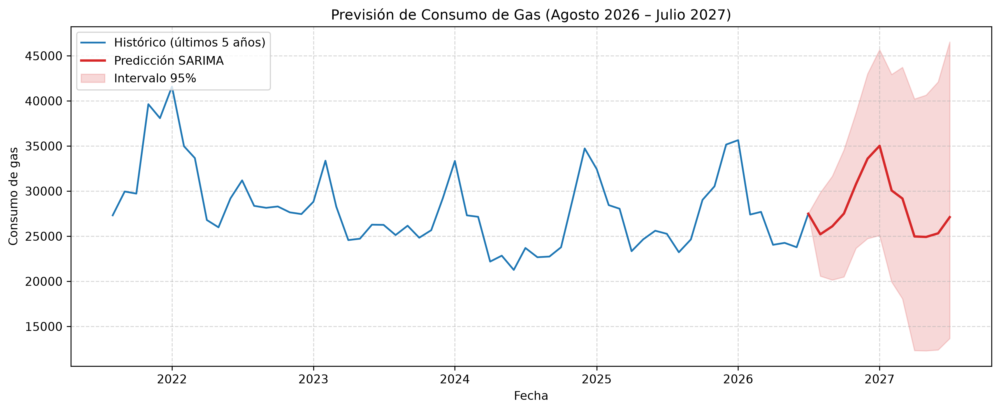

# 📈 Predicción de la Demanda de Gas Natural en España (SARIMA)

Modelización cuantitativa y previsión prospectiva de la demanda mensual de gas natural en España mediante la metodología clásica de Box-Jenkins, análisis de intervención y remuestreo no paramétrico (*bootstrap* residual), implementada en Python.

---

## 📑 Índice de Contenidos

* [1. Descripción del Proyecto](#-descripción-del-proyecto)
* [2. Datos Utilizados](#-datos-utilizados)
* [3. Flujo Metodológico](#-flujo-metodológico)
  * [3.1. Transformaciones y Estacionariedad](#1-transformaciones-y-estacionariedad)
  * [3.2. Identificación y Estimación (General-to-Specific)](#2-identificación-y-estimación-general-to-specific)
  * [3.3. Análisis de Intervención y Estabilidad Estructural](#3-análisis-de-intervención-y-estabilidad-estructural)
  * [3.4. Diagnosis Residual](#4-diagnosis-residual)
* [4. Predicciones e Intervalos Bootstrap (Agosto 2026 – Julio 2027)](#-predicciones-e-intervalos-bootstrap-agosto-2026--julio-2027)
* [5. Limitaciones Metodológicas y Operativas](#-limitaciones-metodológicas-y-operativas)
* [6. Cómo Ejecutar este Proyecto](#-cómo-ejecutar-este-proyecto)
* [7. Bibliografía de Referencia](#-bibliografía-de-referencia)

---

## 📌 Descripción del Proyecto

El objetivo de este proyecto es modelar la serie temporal del consumo agregado de gas natural en España (registrado por CORES) para caracterizar su dinámica estacional y generar proyecciones prospectivas robustas a 12 meses vista (agosto 2026 – julio 2027). Ante la presencia de perturbaciones con colas pesadas (leptocurtosis), se implementan intervalos de predicción al 95% generados mediante simulación *bootstrap* sobre los residuos empíricos.

El flujo de trabajo sigue rigurosamente el proceso econométrico formal:
1. **Análisis exploratorio y estabilización** de media y varianza.
2. **Estrategia General-to-Specific** y validación cruzada temporal (*walk-forward* multianual).
3. **Análisis de intervención y quiebre estructural** (test CUSUM y shock de 2022).
4. **Diagnosis exhaustiva de residuos** (verificación de propiedades de ruido blanco débil).
5. **Reestimación muestral completa, proyección prospectiva y remuestreo no paramétrico**.

---

## 📊 Datos Utilizados

* **Fuente:** Registros oficiales de la Corporación de Reservas Estratégicas de Productos Petrolíferos (CORES).
* **Frecuencia:** Mensual (`freq='MS'`).
* **Rango temporal completo:** Enero 2004 – Julio 2026 ($T = 271$ observaciones)[cite: 16].
* **Estrategia de validación:** 
  * Validación cruzada temporal por ventanas expansivas (*TimeSeriesSplit / Walk-Forward* en 5 ciclos anuales de prueba).
  * Reestimación final sobre el total de la serie ($T = 271$) para la proyección fuera de muestra.

---

## 🔬 Flujo Metodológico

### 1. Transformaciones y Estacionariedad
* **Varianza:** El test de Bartlett ($p > 0.05$) confirmó la estabilidad de la dispersión a lo largo del tiempo, descartando la necesidad de transformaciones no lineales como Box-Cox o logaritmos.
* **Media:** Para corregir la presencia de raíces unitarias y la pauta estacional anual ($s = 12$), se aplicó:
  * Una diferencia estacional ($D = 1, s = 12$).
  * Una diferencia regular ($d = 1$).
* Los contrastes de Dickey-Fuller aumentado (ADF) ratificaron la estacionariedad estricta del proceso doblemente diferenciado.

### 2. Identificación y Estimación (*General-to-Specific*)
Se contrastaron tres especificaciones candidatas representativas:

| Modelo | Especificación | Parámetros Significativos | BIC | MAPE (Último Fold) | MAPE Promedio (Walk-Forward) |
| :--- | :--- | :---: | :---: | :---: | :---: |
| **Modelo 1** | $\text{SARIMA}(1,1,1)(1,1,1)_{12}$ | No (`ar.S.L12`, $p = 0.228$) | 4768.14 | 4.74% | 9.51% |
| **Modelo 2** | $\text{SARIMA}(1,1,1)(0,1,1)_{12}$ | Sí ($p < 0.05$) | 4755.74 | 5.05% | 9.65% |
| **Modelo 3 (Elegido)** | $\text{SARIMA}(0,1,1)(0,1,1)_{12}$ | Sí ($p < 0.001$) | 4752.73 | 5.08% | 10.05% |

**Criterio de selección:**
Aunque `auto_arima` favorecía marginalmente al Modelo 2 por AIC ($4741.52$ vs. $4742.07$), se seleccionó el Modelo 3 bajo el principio de parsimonia, minimización estricta del criterio bayesiano ($\text{BIC} = 4752.733$) y la eliminación del término autorregresivo, presentando un desempeño predictivo equivalente en el régimen reciente (5.08% vs. 5.05%).

Ecuación estimada del modelo final ($T = 271$):

$$(1 - B)(1 - B^{12}) y_t = (1 - 0.2449 B)(1 - 0.7834 B^{12}) \hat{\varepsilon}_t$$

Forma desarrollada para cálculo recursivo en niveles:

$$y_t = y_{t-1} + y_{t-12} - y_{t-13} + \hat{\varepsilon}_t - 0.2449 \hat{\varepsilon}_{t-1} - 0.7834 \hat{\varepsilon}_{t-12} + 0.1919 \hat{\varepsilon}_{t-13}$$

### 3. Análisis de Intervención y Estabilidad Estructural
Antes de fijar el modelo definitivo, se contrastó la incorporación de una variable ficticia de intervención (*dummy*) a partir de marzo de 2022 para evaluar el quiebre de la crisis energética:
* **Falta de significación:** El parámetro de intervención resultó no significativo ($\hat{\beta} = -356.91$, $p = 0.942$), incrementando los criterios de penalización ($\text{AIC} = 4743.88$, $\text{BIC} = 4758.09$). Esto constató que el filtro de doble diferenciación absorbe por sí mismo el salto de nivel de la serie.
* **Estabilidad de parámetros:** El contraste CUSUM sobre los residuos arrojó un $p\text{-valor} = 0.2245$, confirmando la estabilidad estructural del modelo a lo largo de la muestra.

### 4. Diagnosis Residual
Tras descontar los 13 períodos iniciales asociados al transitorio del filtro ($d=1, D=1, s=12$), los residuos ratifican las condiciones de ruido blanco débil:
* **Media nula:** $\mu_{\varepsilon} = -148.48\text{ GWh}$ (despreciable frente a los niveles medios de consumo mensual superiores a $30\,000\text{ GWh}$).
* **Incorrelación serial:** Inspección de correlogramas (ACF y PACF) limpios a 24 retardos y contrastes de Ljung-Box con $p$-valores ampliamente superiores al nivel de significación ($0.221 \le p \le 0.780$).
* **Homocedasticidad condicional y global:** Contraste ARCH-LM de Engle ($p = 0.3632$) y estadístico de heterocedasticidad de Harvey ($H = 0.95, p = 0.81$).
* **Normalidad:** Test de Jarque-Bera ($p = 0.000$). El rechazo de la hipótesis de normalidad por exceso de curtosis motivó el abandono de los intervalos analíticos gaussianos en favor de métodos de remuestreo empírico.

---

## 🔮 Predicciones e Intervalos Bootstrap (Agosto 2026 – Julio 2027)

El modelo proyecta el siguiente ciclo operativo anual anticipando la estacionalidad del mercado español:
* **Pico invernal:** Enero de 2027 ($35\,019.72\text{ GWh}$).
* **Valles estivales:** Demanda estabilizada en torno a $24\,900\text{ GWh}$ en los meses cálidos.
* **Cuantificación de incertidumbre por *Bootstrap*:** Se realizaron $1\,000$ simulaciones condicionales de trayectorias con reemplazo fijadas de forma reproducible (`random_state=rng`). Los intervalos de predicción empíricos (percentiles 2.5 y 97.5) delimitan un rango prospectivo que abarca desde $12\,301\text{ GWh}$ en valles hasta $46\,529\text{ GWh}$ al final de las predicciones, protegiendo las previsiones contra la infravaloración del riesgo de cola.



*Trayectoria observada en los últimos 5 años empalmada con las proyecciones puntuales (agosto 2026 – julio 2027) y bandas de confianza empíricas al 95% obtenidas vía bootstrap residual.*

---

## ⚠️ Limitaciones Metodológicas y Operativas

1. **Naturaleza univariante:** La proyección se fundamenta en la memoria estocástica de la serie. No incorpora de forma dinámica variables climatológicas inmediatas (grados día de calefacción o frentes polares imprevistos) ni la evolución del precio mayorista en MIBGAS/TTF.
2. **Dilatación temporal de bandas:** En procesos con doble integración estocástica ($d=1, D=1$), el error estándar de predicción se expande de forma monótona conforme se incrementa el horizonte prospectivo (desde $2\,295.12$ en el mes 1 hasta $6\,189.46$ en el mes 12).
3. **Dependencia del régimen estacional:** El modelo asume la continuidad del patrón anual característico del consumo nacional; variaciones drásticas en la electrificación de la calefacción o sustitución industrial alterarían la estructura cíclica.

---

## 🚀 Cómo Ejecutar este Proyecto

### 1. Clonar el repositorio

```bash
git clone https://github.com/diegoagudoa-eng/gas-demand-forecasting-sarima.git
cd gas-demand-forecasting-sarima
```

### 2. Instalar las dependencias del entorno

```bash
pip install -r requirements.txt
```

### 3. Abrir y ejecutar el notebook

```bash
jupyter notebook gas_demand_forecasting.ipynb
```
---

## 📚 Bibliografía de Referencia

* Box, G. E. P., Jenkins, G. M., Reinsel, G. C., & Ljung, G. M. (2015). *Time Series Analysis: Forecasting and Control* (5.ª ed.). John Wiley & Sons.
* Brown, R. L., Durbin, J., & Evans, J. M. (1975). Techniques for testing the constancy of regression relationships over time. *Journal of the Royal Statistical Society: Series B (Methodological)*, 37(2), 149-163.
* CORES (2026). *Estadísticas de consumo de gas natural en España (2004–2026)*. Corporación de Reservas Estratégicas de Productos Petrolíferos.
* Dickey, D. A., & Fuller, W. A. (1979). Distribution of the estimators for autoregressive time series with a unit root. *Journal of the American Statistical Association*, 74(366), 427-431.
* Efron, B., & Tibshirani, R. J. (1994). *An Introduction to the Bootstrap*. Chapman & Hall/CRC.
* Engle, R. F. (1982). Autoregressive Conditional Heteroscedasticity with Estimates of the Variance of United Kingdom Inflation. *Econometrica*, 50(4), 987-1007.
* Hamilton, J. D. (1994). *Time Series Analysis*. Princeton University Press.
* Harvey, A. C. (1989). *Forecasting, Structural Time Series Models and the Kalman Filter*. Cambridge University Press.
* Jarque, C. M., & Bera, A. K. (1987). A test for normality of observations and regression residuals. *International Statistical Review*, 55(2), 163-172.
* Ljung, G. M., & Box, G. E. P. (1978). On a measure of lack of fit in time series models. *Biometrika*, 65(2), 297-303.
* Pankratz, A. (1983). *Forecasting with Univariate Box-Jenkins Models: Concepts and Cases*. John Wiley & Sons.
* Peña Sánchez-Rivera, D. (2010). *Análisis de series temporales*. Alianza Editorial.)
